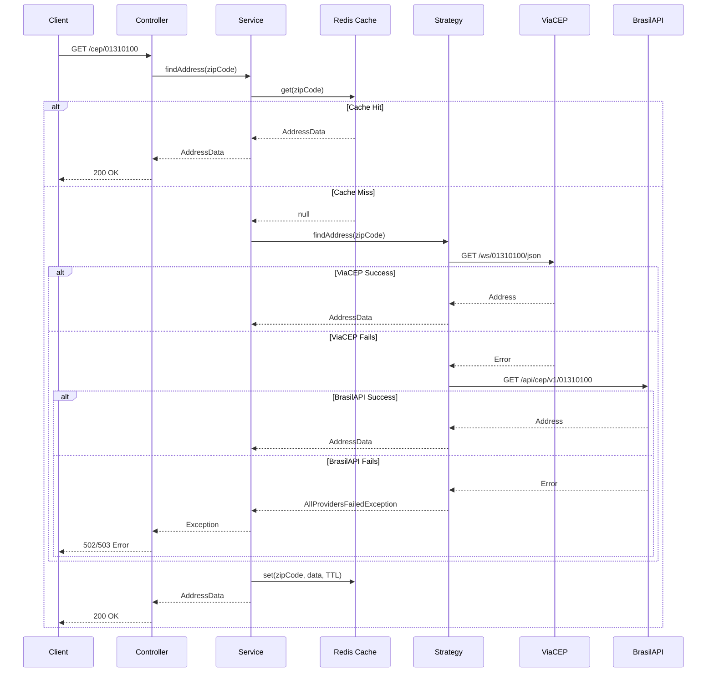
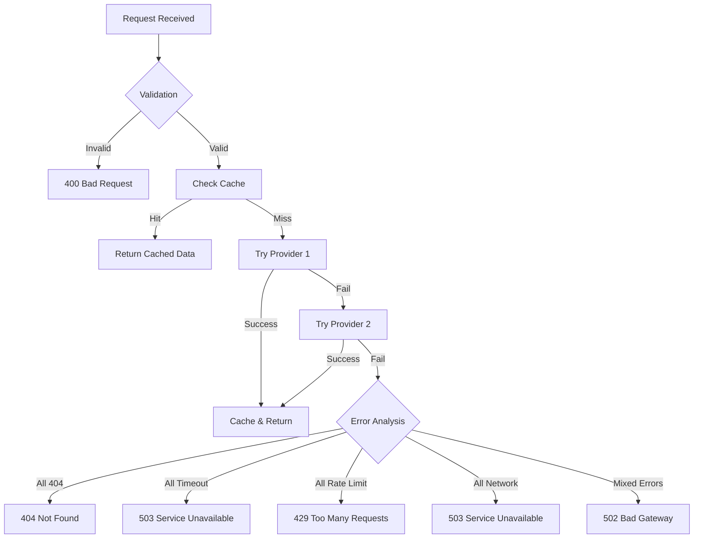

# CEP API - Technical Documentation

A resilient and scalable API for querying Brazilian ZIP codes (CEP) with automatic fallback between multiple providers.

## Table of Contents

- [Overview](#overview)
- [Architecture](#architecture)
- [Technologies](#technologies)
- [Design Patterns](#design-patterns)
- [Getting Started](#getting-started)
- [Project Structure](#project-structure)
- [Technical Decisions](#technical-decisions)
- [Flow Diagrams](#flow-diagrams)
- [API Documentation](#api-documentation)
- [Error Handling](#error-handling)
- [Observability](#observability)
- [Performance](#performance)

---

## Overview

This API solves the problem of reliably querying Brazilian ZIP codes when depending on external services that can fail, timeout, or become unavailable. The solution implements automatic failover between multiple providers (ViaCEP and BrasilAPI) with intelligent retry logic.

### Key Features

- **Automatic Failover**: Round-robin distribution with automatic fallback
- **Resilience**: Handles timeouts, network errors, rate limits, and service unavailability
- **Observability**: Structured logging with execution tracking
- **Caching**: Redis-based cache with 30-day TTL
- **Validation**: Input validation with clear error messages
- **Extensibility**: Easy to add new ZIP code providers
- **Documentation**: Interactive Swagger/OpenAPI documentation

---

## Architecture

### High-Level Architecture

```
┌─────────────┐
│   Client    │
└──────┬──────┘
       │
       │ HTTP Request
       ▼
┌─────────────────────────────────────────┐
│           NestJS Application            │
│  ┌───────────────────────────────────┐  │
│  │      Address Controller           │  │
│  └────────────┬──────────────────────┘  │
│               │                         │
│               ▼                         │
│  ┌───────────────────────────────────┐  │
│  │      Address Service              │  │
│  │  ┌─────────────────────────────┐  │  │
│  │  │    Redis Cache Layer        │  │  │
│  │  └─────────────────────────────┘  │  │
│  └────────────┬──────────────────────┘  │
│               │                         │
│               ▼                         │
│  ┌───────────────────────────────────┐  │
│  │  Address Adapter Strategy         │  │
│  │  (Round-robin + Fallback)         │  │
│  └────┬────────────────────┬─────────┘  │
│       │                    │            │
│       ▼                    ▼            │
│  ┌─────────┐          ┌─────────┐       │
│  │ ViaCEP  │          │BrasilAPI│       │
│  │ Adapter │          │ Adapter │       │
│  └────┬────┘          └────┬────┘       │
└───────┼──────────────────────┼──────────┘
        │                      │
        │ HTTP                 │ HTTP
        ▼                      ▼
   ┌─────────┐            ┌──────────┐
   │ ViaCEP  │            │BrasilAPI │
   │   API   │            │   API    │
   └─────────┘            └──────────┘
```

### Layer Architecture

The project follows **Clean Architecture** principles with clear separation of concerns:

```
┌─────────────────────────────────────────────────────┐
│                 Infrastructure Layer                │
│  (HTTP Controllers, Adapters, External Services)    │
└────────────────────┬────────────────────────────────┘
                     │
                     ▼
┌─────────────────────────────────────────────────────┐
│                 Application Layer                   │
│     (Business Logic, Services, Strategies)          │
└────────────────────┬────────────────────────────────┘
                     │
                     ▼
┌─────────────────────────────────────────────────────┐
│                   Domain Layer                      │
│    (Entities, Interfaces, Business Rules)           │
└─────────────────────────────────────────────────────┘
```

---

## Technologies

### Core Framework
- **NestJS** (v10): Progressive Node.js framework with TypeScript
- **TypeScript** (v5): Type-safe development
- **Node.js** (v18+): Runtime environment

### HTTP & Communication
- **Axios**: HTTP client for external API calls
- **@nestjs/axios**: NestJS integration for Axios

### Caching
- **Redis** (v7): In-memory data store
- **cache-manager**: Caching abstraction layer
- **cache-manager-redis-yet**: Redis adapter for cache-manager

### Validation
- **class-validator**: Decorator-based validation
- **class-transformer**: Object transformation

### Logging
- **Pino**: High-performance JSON logger
- **nestjs-pino**: NestJS integration for Pino
- **pino-pretty**: Human-readable log formatting (development)

### Documentation
- **@nestjs/swagger**: OpenAPI/Swagger documentation
- **swagger-ui-express**: Interactive API documentation UI

### Development Tools
- **ESLint**: Code linting
- **Prettier**: Code formatting
- **Docker Compose**: Container orchestration for Redis

---

## Design Patterns

### 1. **Strategy Pattern**

Used in `AddressAdapterStrategy` to encapsulate the algorithm for selecting and executing different ZIP code providers.

**Benefits:**
- Easy to add new providers without modifying existing code
- Runtime provider selection
- Isolated provider logic

**Implementation:**
```typescript
interface AddressAdapter {
  findAddress(input: findAddressInput): Promise<AddressData>;
}

class ViaCepAdapter implements AddressAdapter { }
class BrasilApiAdapter implements AddressAdapter { }
class AddressAdapterStrategy implements AddressAdapter { }
```

### 2. **Adapter Pattern**

Each external API (ViaCEP, BrasilAPI) has its own adapter that converts the external format to our internal `AddressData` entity.

**Benefits:**
- Uniform interface for different APIs
- Easy to swap or add providers
- Internal code independent of external API changes

### 3. **Dependency Injection**

NestJS's built-in DI container manages all dependencies.

**Benefits:**
- Loose coupling
- Easy testing (mock injection)
- Single Responsibility Principle

### 4. **Decorator Pattern**

Custom `@LogExecution` decorator for automatic method logging.

**Benefits:**
- Cross-cutting concerns separation
- Reusable logging logic
- Clean business logic

### 5. **Factory Pattern**

Used in `address.module.ts` to create the strategy with multiple adapters.

```typescript
{
  provide: AddressAdapter,
  useFactory: (logger, viaCep, brasilApi) => {
    return new AddressAdapterStrategy(logger, [viaCep, brasilApi]);
  },
  inject: [Logger, ViaCepAdapter, BrasilApiAdapter],
}
```

### 6. **Chain of Responsibility**

Implicit in the strategy's retry logic - each adapter tries to handle the request, passing to the next on failure.

---

## Getting Started

### Prerequisites

- **Node.js** >= 18.x
- **npm** or **yarn**
- **Docker** and **Docker Compose** (for Redis)

### Installation

1. **Clone the repository**
```bash
git clone https://github.com/jtiagosantos/teste-dev
cd api
```

2. **Install dependencies**
```bash
npm install
```

3. **Set up environment variables**
```bash
cp .env.sample .env
```

1. **Start Redis**
```bash
docker-compose up -d
```

1. **Run the application**

Development mode:
```bash
npm run start:dev
```

Production mode:
```bash
npm run build
npm run start:prod
```

6. **Access the API**
- API: `http://localhost:3000`
- Swagger Documentation: `http://localhost:3000/api/docs`

---

## Project Structure

```
src/
├── main.ts                          # Application entry point
├── app.module.ts                    # Root module
│
├── modules/
│   └── address/                     # Address/CEP module
│       ├── address.module.ts        # Module definition
│       │
│       ├── application/             # Application layer
│       │   ├── services/
│       │   │   └── address.service.ts        # Business logic & cache
│       │   └── strategies/
│       │       └── address-adapter.strategy.ts # Provider selection & fallback
│       │
│       ├── domain/                  # Domain layer
│       │   ├── adapters/
│       │   │   └── address.adapter.ts        # Interface definition
│       │   ├── entities/
│       │   │   └── address.entity.ts         # Domain entity
│       │   └── exceptions/
│       │       └── address.exceptions.ts     # Custom exceptions
│       │
│       └── infrastructure/          # Infrastructure layer
│           └── http/
│               ├── controllers/
│               │   ├── address.controller.ts # HTTP endpoint
│               │   └── dtos/
│               │       └── find-address.dto.ts # Input validation
│               └── adapters/
│                   ├── viacep/
│                   │   └── viacep.adapter.ts  # ViaCEP integration
│                   └── brasilApi/
│                       └── brasilApi.adapter.ts # BrasilAPI integration
│
└── shared/                          # Shared utilities
    └── logging/
        ├── logger.ts                # Logger service
        ├── logging.module.ts        # Logging module
        └── decorators/
            └── log-execution.decorator.ts # Logging decorator
```

### Layer Responsibilities

**Domain Layer:**
- Core business entities (`Address`)
- Interfaces/contracts (`AddressAdapter`)
- Domain exceptions
- Business rules

**Application Layer:**
- Use cases (`AddressService`)
- Business logic orchestration
- Strategy implementations
- Caching logic

**Infrastructure Layer:**
- HTTP controllers (REST API)
- External API adapters
- Data validation (DTOs)
- Framework-specific implementations

---

## Technical Decisions

### 1. Round-Robin vs Random Provider Selection

**Decision:** Round-robin

**Rationale:**
- Fair distribution of load across providers
- Predictable behavior for testing
- Simple index-based implementation

**Alternative:** Random selection
- Pros: Simpler to implement
- Cons: Uneven distribution, harder to test

### 2. Cache Strategy

**Decision:** Cache on first successful fetch with 30-day TTL

**Rationale:**
- ZIP codes rarely change
- Reduces external API dependency
- Improves response time dramatically (from ~200ms to <10ms)
- Reduces costs (no redundant API calls)

**Tradeoffs:**
- **Pro:** Excellent performance, reduced external calls
- **Con:** Stale data risk (mitigated by long but finite TTL)
- **Con:** Memory usage (mitigated by Redis)

**Alternative Considered:** No caching
- Pros: Always fresh data
- Cons: Poor performance, external dependency, higher costs

### 3. Redis vs In-Memory Cache

**Decision:** Redis

**Rationale:**
- Survives application restarts
- Scalable to multiple instances
- Built-in TTL management
- Production-ready

**Tradeoffs:**
- **Pro:** Persistent, shared, scalable
- **Con:** Additional infrastructure dependency
- **Con:** Network latency (minimal with local Redis)

**Alternative:** In-memory cache (cache-manager)
- Pros: No external dependency, slightly faster
- Cons: Lost on restart, not shared across instances

### 4. Structured Logging with Pino

**Decision:** Pino with structured JSON logs

**Rationale:**
- High performance (benchmarks show 5x faster than Winston)
- Structured logs easy to parse and query
- Production-ready (used by Netflix, Uber)
- NestJS integration available

**Format:**
```json
{
  "level": "info",
  "message": "Started execution of findAddress",
  "origin": "AddressService",
  "action": "findAddress",
  "status": "STARTED",
  "payload": {...},
  "timestamp": "2026-02-20T12:00:00.000Z"
}
```

### 5. Custom Exceptions vs Generic HTTP Exceptions

**Decision:** Custom exceptions for each error type

**Rationale:**
- Clear error categorization
- Consistent error responses
- Easier debugging
- Better client experience

**Custom Exceptions:**
- `AddressNotFoundException` (404)
- `InvalidZipCodeException` (400)
- `AllProvidersTimeoutException` (503)
- `AllProvidersRateLimitedException` (429)
- `AllProvidersFailedException` (502)
- And more...

### 6. Validation Strategy

**Decision:** DTO validation with `class-validator`

**Rationale:**
- Declarative validation
- Automatic error messages
- Type safety
- Reusable validators

```typescript
export class FindAddressDto {
  @IsString()
  @Length(8, 8)
  @Matches(/^\d{8}$/)
  zipCode: string;
}
```

### 7. Fallback Strategy

**Decision:** Try all providers before failing

**Rationale:**
- Maximum resilience
- Only fail when all options exhausted
- Smart error aggregation (all timeouts vs mixed errors)

**Flow:**
```
Request → Provider 1 → Failed → Provider 2 → Failed → Error
```

### 8. Timeout Handling

**Decision:** Rely on Axios default timeout (can be configured)

**Rationale:**
- Simple implementation
- Configurable at module level
- Natural error propagation

**Alternative:** Custom timeout wrapper
- Pros: More control
- Cons: Additional complexity

---

## Flow Diagrams

### Request Flow Diagram



### Error Handling Flow



---

## API Documentation

### Endpoints

#### `GET /cep/:zipCode`

Query address information by Brazilian ZIP code.

**Parameters:**
- `zipCode` (path, required): 8-digit ZIP code (numbers only)

**Success Response (200):**
```json
{
  "zipCode": "01310100",
  "street": "Avenida Paulista",
  "neighborhood": "Bela Vista",
  "city": "São Paulo",
  "state": "SP"
}
```

**Error Responses:**

**400 - Invalid Format:**
```json
{
  "statusCode": 400,
  "message": [
    "zipCode parameter must contain only numbers",
    "zipCode parameter must be exactly 8 digits"
  ],
  "error": "Bad Request"
}
```

**404 - Not Found:**
```json
{
  "statusCode": 404,
  "message": "Address not found",
  "error": "Not Found",
  "detail": "No provider could find address for zipCode: 00000000",
  "zipCode": "00000000"
}
```

**429 - Rate Limited:**
```json
{
  "statusCode": 429,
  "message": "Rate limit exceeded on all providers",
  "error": "Too Many Requests",
  "detail": "Too many requests on all providers. Please try again later",
  "zipCode": "01310100",
  "providers": ["ViaCepAdapter", "BrasilApiAdapter"]
}
```

**502 - All Providers Failed:**
```json
{
  "statusCode": 502,
  "message": "All address providers failed",
  "error": "Bad Gateway",
  "detail": "Unable to fetch address from any provider. Multiple different errors occurred",
  "zipCode": "01310100",
  "errors": [
    {
      "provider": "ViaCepAdapter",
      "error": "Network error",
      "timestamp": "2026-02-20T12:00:00.000Z"
    }
  ]
}
```

**503 - Service Unavailable:**
```json
{
  "statusCode": 503,
  "message": "All providers timed out",
  "error": "Service Unavailable",
  "detail": "All services are slow or unavailable. Please try again later",
  "zipCode": "01310100",
  "providers": ["ViaCepAdapter", "BrasilApiAdapter"]
}
```

### Interactive Documentation

Access Swagger UI at: `http://localhost:3000/api/docs`

Features:
- Try out endpoints directly
- See all request/response schemas
- View all possible error responses
- Example values for all fields

---

## Error Handling

### Exception Hierarchy

All custom exceptions extend `HttpException` from NestJS:

```typescript
HttpException
├── AddressNotFoundException (404)
├── InvalidZipCodeException (400)
├── AddressProviderTimeoutException (408)
├── AddressProviderUnavailableException (503)
├── RateLimitException (429)
├── NetworkErrorException (502)
├── AllProvidersFailedException (502)
├── AllProvidersTimeoutException (503)
├── AllProvidersUnavailableException (503)
└── AllProvidersRateLimitedException (429)
```

### Error Detection Logic

The strategy intelligently categorizes errors:

```typescript
private handleAllFailures(errors: AdapterError[], zipCode: string): never {
  // All providers returned 404
  if (allNotFound) throw new AddressNotFoundException();
  
  // All providers timed out
  if (allTimeouts) throw new AllProvidersTimeoutException();
  
  // All providers unreachable (network errors)
  if (allNetworkErrors) throw new AllProvidersUnavailableException();
  
  // All providers rate limited
  if (allRateLimited) throw new AllProvidersRateLimitedException();
  
  // Mixed different errors
  throw new AllProvidersFailedException();
}
```

### Error Response Format

All errors follow a consistent structure:

```typescript
{
  statusCode: number;      // HTTP status code
  message: string;         // Human-readable message
  error: string;           // Error type (e.g., "Not Found")
  detail?: string;         // Additional context
  zipCode?: string;        // Requested ZIP code
  providers?: string[];    // Failed providers (when applicable)
  errors?: ErrorDetail[];  // Individual errors (when applicable)
}
```

---

## Observability

### Logging Strategy

#### Log Levels

- **info**: Successful operations, cache hits, provider selection
- **error**: Failures, exceptions, provider errors
- **debug**: Detailed execution information (development only)

#### Log Structure

```typescript
{
  message: string;          // Descriptive message
  origin: string;           // Class name
  action: string;           // Method name
  status: LogStatus;        // STARTED | FINISHED | FAILED
  payload: Record<string, any>; // Contextual data
}
```

#### Automatic Logging with Decorator

```typescript
@LogExecution()
async findAddress(input: findAddressInput): Promise<AddressData> {
  // Automatically logs:
  // - START: When method begins
  // - FINISHED: When method succeeds (with result)
  // - FAILED: When method throws (with error details)
}
```

#### Key Logged Events

1. **Request received** - Controller level
2. **Cache hit/miss** - Service level
3. **Provider attempt** - Strategy level
4. **Provider success** - Strategy level
5. **Provider failure** - Strategy level (with error details)
6. **Final response** - Service level

#### Example Log Output (Development)

```
[14:32:10] INFO: Started execution of findAddress
  origin: "AddressService"
  action: "findAddress"
  status: "STARTED"

[14:32:10] INFO: Address found in cache for zipCode: 01310100
  origin: "AddressService"
  action: "findAddress"
  status: "FINISHED"
  payload: {
    input: { zipCode: "01310100" },
    output: { zipCode: "01310100", street: "...", ... }
  }
```

#### Example Log Output (Production)

```json
{"level":30,"message":"Started execution of findAddress","origin":"AddressService","action":"findAddress","status":"STARTED","time":1708440730000}
{"level":30,"message":"Address found in cache","origin":"AddressService","action":"findAddress","status":"FINISHED","payload":{"input":{"zipCode":"01310100"},"output":{...}},"time":1708440730050}
```

### Monitoring Considerations

For production monitoring, integrate with:
- **Prometheus**: Metrics collection (response times, error rates)
- **Grafana**: Visualization dashboards
- **ELK Stack**: Log aggregation and search
- **Sentry**: Error tracking and alerting
- **New Relic/DataDog**: APM (Application Performance Monitoring)

### Key Metrics to Track

- Request count by status code
- Response time (p50, p95, p99)
- Cache hit rate
- Provider success rate
- Provider selection distribution
- Error rate by provider
- Error rate by error type

---

## Performance

### Benchmarks

**Without Cache (Cold Start):**
- Average response time: ~200-500ms
- Depends on external provider response time

**With Cache (Warm):**
- Average response time: <10ms
- 95% from Redis cache

### Cache Benefits

**30-Day TTL Analysis:**
- Typical usage: 1000 requests/day
- Unique ZIP codes: ~100/day
- Cache hit rate: ~90% after first day
- External API calls reduced by 90%

**Cost Impact:**
- Without cache: 1000 API calls/day = ~30,000/month
- With cache: ~100 API calls/day = ~3,000/month
- **Savings: 90% reduction in external API calls**

### Scalability Considerations

**Horizontal Scaling:**
- Stateless application design
- Shared Redis cache across instances
- Round-robin load balancing compatible

**Vertical Scaling:**
- Redis memory: ~100 bytes per cached ZIP
- 1M ZIP codes = ~100MB Redis memory
- Node.js handles 1000s of concurrent requests

**Rate Limiting:**
- Consider implementing rate limiting at API gateway
- Per-client quotas if needed
- Protect against DDoS

---

## Future Improvements

### 1. Circuit Breaker Pattern

Implement circuit breaker for failing providers:
- Open circuit after N consecutive failures
- Half-open state for recovery testing
- Prevents cascading failures

Library: `@nestjs/circuit-breaker` or `opossum`

### 2. Metrics & Analytics

Add instrumentation:
- Response time histograms
- Provider performance comparison
- Cache effectiveness metrics
- Error rate trends

### 3. Health Checks

Add health check endpoint:
- Redis connectivity
- Provider availability
- Application status

```typescript
@Get('/health')
healthCheck() {
  return {
    status: 'ok',
    redis: await this.checkRedis(),
    providers: await this.checkProviders()
  };
}
```

### 4. Rate Limiting

Implement API rate limiting:
- Per-client quotas
- Graceful degradation
- Queue management

### 5. Additional Providers

Easy to add more ZIP code providers:
1. Create new adapter implementing `AddressAdapter`
2. Add to providers array in module
3. No changes to existing code needed

### 6. Batch Queries

Support multiple ZIP codes in single request:
```typescript
POST /cep/batch
["01310100", "20040020", "30140071"]
```

### 7. Webhooks/Events

Emit events for monitoring:
- Provider failure events
- Cache miss events
- Error events

### 8. GraphQL Support

Add GraphQL endpoint as alternative to REST

---

**Built with ❤️ using NestJS and TypeScript**
